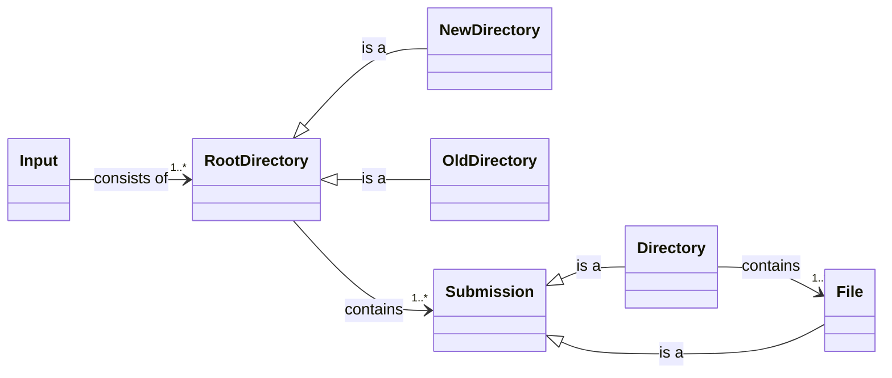

JPlag can be used via the Command Line Interface (CLI) or programmatically via the Java API.

## Using JPlag via the CLI
JPlag can be used via the Command Line Interface by executing the JAR file.

Example: `java -jar jplag.jar path/to/the/submissions`

The language can either be set with the -l parameter or as a subcommand. If both a subcommand and the -l option are specified, the subcommand will take priority.
When using the subcommand, language-specific arguments can be set.
A list of language-specific options can be obtained by requesting the help page of a subcommand (e.g., "jplag java -h").

To run JPlag normally on a set of submissions, run: `java -jar jplag.jar -l <language> <path/to/submissions>`
If the language is Java, it can be omitted: `java -jar jplag.jar <path/to/submissions>`

To open an existing report run: `java -jar jplag.jar </path/to/report.jplag>`

To open the report viewer without any file selected run: `java -jar jplag.jar`

This is the list of all options available to configure JPlag:
```
Parameter descriptions: 
      [root-dirs[,root-dirs...]...]
                        Root-directory with submissions to check for
                          plagiarism. If mode is set to VIEW, this parameter
                          can be used to specify a report file to open. In that
                          case only a single file may be specified.
      -bc, --bc, --base-code=<baseCode>
                        Path to the base code directory (common framework used
                          in all submissions).
      -l, --language=<language>
                        Select the language of the submissions (default: java).
                          See subcommands below.
      -M, --mode=<{RUN, VIEW, RUN_AND_VIEW, AUTO}>
                        The mode of JPlag. One of: RUN, VIEW, RUN_AND_VIEW,
                          AUTO (default: null). If VIEW is chosen, you can
                          optionally specify a path to an existing report.
      -n, --shown-comparisons=<shownComparisons>
                        The maximum number of comparisons that will be shown in
                          the generated report, if set to -1 all comparisons
                          will be shown (default: 2500)
      -new, --new=<newDirectories>[,<newDirectories>...]
                        Root-directories with submissions to check for
                          plagiarism (same as root).
      --normalize       Activate the normalization of tokens. Supported for
                          languages: Java, C++.
      -old, --old=<oldDirectories>[,<oldDirectories>...]
                        Root-directories with prior submissions to compare
                          against.
      -r, --result-file=<resultFile>
                        Name of the file in which the comparison results will
                          be stored (default: results). Missing .jplag
                          extension will be automatically added.
      -t, --min-tokens=<minTokenMatch>
                        Tunes the comparison sensitivity by adjusting the
                          minimum token required to be counted as a matching
                          section. A smaller value increases the sensitivity
                          but might lead to more false-positives.

Advanced
      --csv-export      Export pairwise similarity values as a CSV file.
      -d, --debug           Store on-parsable files in error folder.
      --encoding=<submissionCharsetOverride>
                        Specifies the charset of the submissions. This disables
                          the automatic charset detection
      --log-level=<{ERROR, WARN, INFO, DEBUG, TRACE}>
                        Set the log level for the cli.
      -m, --similarity-threshold=<similarityThreshold>
                        Comparison similarity threshold [0.0-1.0]: All
                          comparisons above this threshold will be saved
                          (default: 0.0).
      --overwrite       Existing result files will be overwritten.
      -p, --suffixes=<suffixes>[,<suffixes>...]
                        comma-separated list of all filename suffixes that are
                          included.
      -P, --port=<port>     The port used for the internal report viewer (default:
                          1996).
      -s, --subdirectory=<subdirectory>
                        Look in directories <root-dir>/*/<dir> for programs.
      -x, --exclusion-file=<exclusionFileName>
                        All files named in this file will be ignored in the
                          comparison (line-separated list).

Clustering
      --cluster-alg, --cluster-algorithm=<{AGGLOMERATIVE, SPECTRAL}>
                        Specifies the clustering algorithm. Available
                          algorithms: agglomerative, spectral (default:
                          spectral).
      --cluster-metric=<{AVG, MIN, MAX, INTERSECTION, LONGEST_MATCH,
        MAXIMUM_LENGTH}>
                        The similarity metric used for clustering. Available
                          metrics: average similarity, minimum similarity,
                          maximal similarity, matched tokens, number of tokens
                          in the longest match, length of the longer submission
                          (default: average similarity).
      --cluster-skip    Skips the cluster calculation.

Subsequence Match Merging
      --gap-size=<maximumGapSize>
                        Maximal gap between neighboring matches to be merged
                          (between 1 and minTokenMatch, default: 6).
      --match-merging   Enables merging of neighboring matches to counteract
                          obfuscation attempts.
      --neighbor-length=<minimumNeighborLength>
                        Minimal length of neighboring matches to be merged
                          (between 1 and minTokenMatch, default: 2).
      --required-merges=<minimumRequiredMerges>
                        Minimal required merges for the merging to be applied
                          (between 1 and 50, default: 6).

Frequency Analysis
      --analysis-strategy=<{COMPLETE_MATCHES, CONTAINED_MATCHES, SUBMATCHES,
        MATCH_WINDOWS}>
                        Specifies the strategy for frequency analysis, one of:
                          COMPLETE_MATCHES, CONTAINED_MATCHES, SUBMATCHES,
                          MATCH_WINDOWS (default: COMPLETE_MATCHES).
      --frequency       Enables analysis and highlighting of rare matches.
      --weighting=<{PROPORTIONAL, LINEAR, QUADRATIC, SIGMOID}>
                        The function for frequency-based match weighting, one
                          of: PROPORTIONAL, LINEAR, QUADRATIC, SIGMOID
                          (default: SIGMOID).
Languages:
  c
  cpp
  csharp
  emf
  emf-model
  go
  java
  javascript
  kotlin
  llvmir
  multi
  python3
  rlang
  rust
  scala
  scheme
  scxml
  swift
  text
  typescript
```

*Note that the [legacy CLI](https://github.com/jplag/jplag/blob/legacy/README.md) is varying slightly.*

## Using JPlag programmatically
The API makes it easy to integrate JPlag's plagiarism detection into external Java projects.

**Example:**

```java
JavaLanguage language = new JavaLanguage();
language.getOptions(); //Use this to set language specific options, same as language specific arguments above.
Set<File> submissionDirectories = Set.of(new File("/path/to/rootDir"));
File baseCode = new File("/path/to/baseCode");
JPlagOptions options = new JPlagOptions(language, submissionDirectories, Set.of()).withBaseCodeSubmissionDirectory(baseCode);

try {
    JPlagResult result = JPlag.run(options);
     
    // Optional
    ReportObjectFactory reportObjectFactory = new ReportObjectFactory(new File("/path/to/output"));
    reportObjectFactory.createAndSaveReport(result, "/path/to/output");
} catch (ExitException e) {
    // error handling here
}
```

## Report File Generation

After a JPlag run, a zipped result file is automatically created.
The target location of the report can be specified with the `-r` flag.

If the `-r` is not specified, the location defaults `result.jplag`. Specifying the `-r` flag with a path `/path/to/desiredFolder` results in the report being created as `/path/to/desiredFolder.jplag`.

The report will always be zipped unless there is an error during the zipping process. If the zipping process fails, the report will be available in an unzipped version under the specified location. Note that the result files use the file extension `.jplag`.

## Viewing Reports

Starting with version v6.0.0, the report viewer is bundled with JPlag and will be launched automatically. The `--mode` option controls this behavior.

To open the report viewer, run JPlag without additional parameters: `java -jar jplag.jar`. This will open the report viewer in the file selection screen.
An old report can be opened by passing the report file as a parameter to JPlag: `java -jar jplag.jar <report.jplag file>`. This will skip the file selection and immediately open the report.

When running JPlag normally with a set of submissions, the report viewer will be opened with the generated support selected automatically: `java -jar jplag.jar <submission directory> java`
This can be prevented by passing `--mode run` (`java -jar jplag.jar --mode run <submission directory> java`).

Additional information can be found [here](7.-Report-Viewer.md)

## Basic Concepts

This section explains some fundamental concepts about JPlag that make it easier to understand and use.

* **Root directory:** This is the directory in which JPlag will scan for submissions.
* **Submissions:** Submissions contain the source code JPlag will parse and compare. They have to be direct children of the root directory and can either be single files or directories.

### Single-file submissions

```
/path/to/root-directory
├── Submission-1.java
├── ...
└── Submission-n.java
```

### Directory submissions

JPlag will read submission directories recursively, thus they can contain multiple (nested) source code files.

```
/path/to/root-directory
├── Submission-1
│   ├── Main.java
│   └── util
│       └── Utils.java
├── ...
└── Submission-n
    ├── Main.java
    └── util
        └── Utils.java
```

If you want JPlag to scan only one specific subdirectory of the submissions for source code files (e.g., `src`), you can configure that with the argument `-s`:

```
/path/to/root-directory
├── Submission-1
│   ├── src                 
│   │   ├── Main.java       # Included
│   │   └── util            
│   │       └── Utils.java  # Included
│   ├── lib                 
│   │   └── Library.java    # Ignored
│   └── Other.java          # Ignored
└── ...
```


### Base Code

The base code is a special kind of submission. It is the template on which all other submissions are based. JPlag will ignore all matches between two submissions where the matches are also part of the base code. Like any other submission, the base code has to be a single file or directory in the root directory.

```
/path/to/root-directory
├── BaseCode
│   └── Solution.java
├── Submission-1
│   └── Solution.java
├── ...
└── Submission-n
    └── Solution.java
```

In this example, students must solve a problem by implementing the `run` method in the template below. Because they are not supposed to modify the `main` function, it will be identical for each student. 

```java
// BaseCode/Solution.java
public class Solution {

    // DO NOT MODIFY
    public static void main(String[] args) {
        Solution solution = new Solution();  
        solution.run();
    }
    
    public void run() {
        // TODO: Implement your solution here.
    }
}
```

To prevent JPlag from detecting similarities in the `main` function (and other parts of the template), we can instruct JPlag to ignore matches with the given base code by providing the `-bc=<base-code-name>` option. 
The `<base-code-name>` in the example above is `BaseCode`.

### Multiple Root Directories
* You can run JPlag with multiple root directories; JPlag compares submissions from all of them
* JPlag distinguishes between old and new root directories
** Submissions in new root directories are checked amongst themselves and against submissions from other root directories
** Submissions in old root directories are only checked against submissions from other new root directories
* You need at least one (new) root directory to run JPlag

This allows you to check submissions against those of previous years:
```
/path/to/root-new
└── ...
/path/to/root-old1
└── ...
/path/to/root-old2
└── ...
```

### Details

The following diagram shows all the relations between root directories, submissions, and files:


