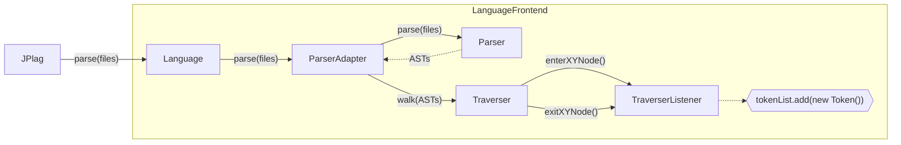
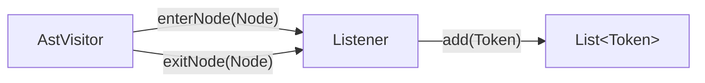

# JPlag Frontend Design

To add support for a new language to JPlag, a JPlag frontend needs to be created for that specific language. The core purpose of a frontend is to transform each submission to a list of _Tokens_, an abstraction of the content of the submission files independent of the language of the submissions.<br>
The token lists of the different submissions are then passed on to a comparison algorithm that checks the token lists for matching sequences.

## How are submissions represented? — Notion of _Token_

In the context of JPlag, a Token does not represent a lexical unit, as identifiers, keywords or operators. Instead, Tokens represent syntactic entities, like statements, or control structures. More than one token might be needed to represent the nested structure of a statement or expression in a linear token list.

```java
    class MyClass extends SuperClass {  private String name;  }
    //CLASS_DECLARATION              //CLASS_BODY_BEGIN
                                        //FIELD_DECLARATION
                                                              //CLASS_BODY_END
```
Each comment is intended to represent one token.

From this example in Java, you may be able to see the following things:
 - a class declaration is represented by three tokens of different _types_: `CLASS_DECLARATION`, `CLASS_BODY_BEGIN` and `CLASS_BODY_END`
 - a token is associated with a _position_ in a code file.
 - the abstraction is incomplete, many details of the code are omitted. The original code cannot be reconstructed from the token list, but its structure can.

A few more points about Tokens in JPlag:
 - a token list contains the Tokens from _all files of one submission_. For that reason, Tokens save the _filename_ of their origin in addition to their position.
 - Token types are represented by the `TokenType` interface which has to be adapted for each language individually.
   - For brevity, each token type is also associated with a String description, usually shorter than their name. Looking at the String representations used in existing frontends, you may recognize a kind of convention about how they are formed. The example above uses the full names of token types.

## How does the transformation work?

Here is an outline of the transformation process.
 - each submitted file is _parsed_. The result is a set of ASTs for each submission.
 - each AST is now _traversed_ depth-first. The nodes of the AST represent the grammatical units of the language.
    - upon entering and exiting a node, Tokens can be created that match the type of the node. They are added to the current token list.
    - for block-type nodes like bodies of classes or if expressions, the point of entry and exit correspond to the respective `BEGIN` and `END` token types. If done correctly, the token list should contain balanced pairs of matching `BEGIN` and `END` tokens.

```java
@Override
public void enterClassDeclaration(ClassDeclarationContext context) {
    Token token = new Token(CLASS_DECLARATION, /* more parameters ... */);
    addToken(token);
}

@Override
public void exitClassDeclaration(ClassDeclarationContext context) {
     // class declarations get no end token -> do nothing
}

@Override
public void enterClassBody(ClassBodyContext context) {
    Token token = new Token(CLASS_BODY_START, /* more parameters ... */);
    addToken(token);
}

@Override
public void enterClassDeclaration(ClassBodyContext context) {
    Token token = new Token(CLASS_BODY_END, /* more parameters ... */);
    addToken(token);
}
```
The way the traversal works and how you can interact with the process depends on the parser technology used. In the example above, **ANTLR-generated parsers** were used, as was in most of the current JPlag frontends. We recommend to use ANTLR for any new frontend.

If a hard-coded (as opposed to dynamically generated) parser library is available for your language, it may make sense to use it. An implementation of the visitor pattern for the resulting AST should be included.

# Frontend Structure

A frontend consists of these parts:

| Component/Class                         | Superclass                | Function                                         | How to get there                                            | 
|-----------------------------------------|---------------------------|--------------------------------------------------|-------------------------------------------------------------|
| Language class                          | `de.jplag.Language`       | access point for the frontend                    | copy with small adjustments                                 |
| `pom.xml`                               | -                         | Maven submodule descriptor                       | copy with small adjustments;<br>add dependencies for parser |
| `README.md`                             | -                         | documentation for the frontend                   | copy for consistent structure; adjust from there            |
| TokenType class                    | `de.jplag.TokenType` | contains the language-specific token types           | **implement new**                                           |
|                                         |                           |                                                  |
| Lexer and Parser                        | -                         | transform code into AST                          | depends on technology                                       |
| ParserAdapter class                     | `de.jplag.AbstractParser` | sets up Parser and calls Traverser               | depends on technology                                       |
| Traverser/<br>TraverserListener classes | -                         | creates tokens traversing the AST                | depends on technology                                       |

For example, if ANTLR is used, the setup is as follows:

| Antlr specific parts/files | Superclass                     | Function                           | How to get there                                                                             |                                   
|----------------------------|--------------------------------|------------------------------------|----------------------------------------------------------------------------------------------|
| Grammar files  (`.g4`)     | -                              | capture syntax of the language     | most likely available in [ANTLRv4 Grammar Repository](https://github.com/antlr/grammars-v4/) |
| Lexer and Parser           | `Lexer`, `Parser` (ANTLR)      | transform code into AST            | generated from grammar files by antlr4-maven-plugin                                          |
| Traverser                  | `ParseTreeWalker` (ANTLR)      | traverses AST and calls listener   | included in antlr4-runtime library, can be used as is                                        |
| TraverserListener class    | `ParseTreeListener` (ANTLR)    | creates tokens when called         | **implement new**                                                                            |
| ParserAdapter class        | `de.jplag.AbstractParser`      | sets up Parser and calls Traverser | copy with small adjustments                                                                  | 

As the table shows, much of a frontend can be reused, especially when using ANTLR. The only parts left to implement specifically for each frontend are
 - the ParserAdapter (for custom parsers)
 - the TokenTypes, and
 - the TraverserListener.

**Note** for parser libraries other than ANTLR:
  - It should still be rather easy to implement the ParserAdapter from the library documentation.
  - Instead of using a listener pattern, the library may require you to do the token extraction in a _Visitor subclass_. In that case, there is only one method call per element, called e.g. `traverseClassDeclaration`. The advantage of this version is that the traversal of the subtrees can be controlled freely. See the Scala frontend for an example.

### Basic procedure outline



Note: In existing frontends, the token list is managed by the ParserAdapter, and from there it is returned to the
Language class and then to JPlag.

### Integration into JPlag

The following adjustments have to be made beyond creating the frontend submodule itself:

- Register the submodule in the aggregator POM for every build profile.
```xml
    <!-- ${jPlagRoot}/pom.xml -->
    <modules>
        ...
        <module>jplag.frontend.my-frontend</module>
        ...
    </modules>
```
- Add a dependency from the aggregator module to the new frontend
- Add a dependency from the jplag module to the new frontend
```xml
    <!-- ${jPlagRoot}/pom.xml -->
    <!-- ${jPlagRoot}/jplag/pom.xml -->
    <dependencies>
        ...
        <dependency>
            <groupId>de.jplag</groupId>
            <artifactId>jplag.frontend.my-frontend</artifactId>
            <version>${revision}</version>
        </dependency>
        ...
    </dependencies>
```

That's it! The new frontend should now be usable as described in the main README. The name of the frontend used with the CLI `-l` option is the `IDENTIFIER` set in the Language class.

# Token Selection

Apart from extracting the tokens correctly, the task of deciding which syntactical elements should be assigned a token is the essential part when designing a frontend.<br>
This guideline is solely based on experience and intuition – this "worked well" so far. More research might hint towards a more systematic process of token selection.

The goal of the abstraction is to create a token list that is
 - _accurate_: a fair representation of the code as input to the comparison algorithm
 - _consistent per se_: insensitive to small changes in the code that might obfuscate plagiarism; constructs are represented equally throughout the file
 - _consistent_ with the output of other trusted frontends—only to the extent that their respective languages are comparable, naturally. 

To create a set of tokens in line with these objectives, we offer the tips below.

### Quick Word on Notation

Elements with `BIG_AND_FAT` text represent tokens, while elements in lowercase surrounded by `<angle-brackets>` represent subexpressions that may produce any number of tokens themselves.<br>
? marks optional parts which may occur zero or one times, * marks elements that may occur any number of times.
<hr>

1) Use a separate token for both ends of every type of _block_ or _body_.


2) More generally, for any type of composite expression or statement, the number of designated token types needed to separate them in the token list is the number of subexpressions + 1. 
Additional tokens may make be needed in certain locations, like optional parts.

| Expression type    | #expressions | #tokens | Example code and tokenization pattern                                                                                                                               |
|--------------------|--------------|---------|---------------------------------------------------------------------------------------------------------------------------------------------------------------------|
| _loop_ (Rust)      | 1            | 2       | `loop { println!("{}", 1) }`<p></p>`LOOP{` `<statements>` `}LOOP`                                                                                                           |
| _if_ (C)           | 2            | 3       | `if (true) { printf("1"); } `<p></p>`IF` `<condition>` `IF{` `<statements>` `}IF`                                                                                     |
| _do-while_ (C)     | 2            | 3       | `do { printf("1") } while (true);`<p></p>`DO{` `<statements>` `}DO-WHILE(` `<condition>` `)WHILE`<br>alt.: `DO{` `<statements>` `}DO` `WHILE(` `<condition>` `)WHILE` |
| Ternary – _?:_ (C) | 3            | 4       | `true ? 1 : 0`<p></p>`COND(` `<condition>` `IF_TRUE:` `<expression>` `IF_FALSE:` `<expression>` `)COND`                                                             |

In the do-while example above, the `}DO-WHILE(` marks the end of the loop block and the beginning of the condition expression at once. For the sake of having a designated token for the ending of the loop block, a possible alternative tokenization with an extra token is given.     

3) For _list_ subtrees, a single token to mark the beginning of each element may suffice.<br>
Note: If lists of the same type are nested, the end of the inner list may become unclear. Additional tokens for both ends of the list may be appropriate in that case. 


4) For _leaf_ subtrees (that do not subdivide further), a single token may suffice.


5) For _optional_ subtrees, a single token may suffice to indicate that it occurred. 

| Optional expression type                   | #expressions | #tokens | Example code and tokenization pattern                                                                                                    |
|--------------------------------------------|--------------|---------|------------------------------------------------------------------------------------------------------------------------------------------|
| Class declaration: generic type parameters | _n_ + 1      | _n_ + 2 | `class Map<K,V> { ... }`<p></p>`CLASS` (`TYPE_PARAM`)* `CLASS{` `<body>` `}CLASS`                                                        |
| Method invocation: arguments               | _n_          | _n_ + 1 | `printf("%d: %s", 1, "one");`<p></p>`APPLY` (`ARG` `<expression>`)*                                                                      |
| _if_ statement: _else_ block               | 2 (+ 1)      | 3 (+ 2) | `if (true) { printf("1"); } else { printf("0"); }`<p></p>`IF` `<condition>` `IF{` `<statements>` `}IF` (`ELSE{` `<statements>` `}ELSE`)? |


6) Keywords that influence the control flow receive a token, for example
   - `return`, `break`, `continue`
   
   
7) Semantic information, references and concrete values are generally omitted, for example
    - identifiers
    - type information
    - `final` modifier
    - access modifiers
    - instructions to the compiler/VM: `transient`, `volatile`
    - references to classes, objects, fields, array accesses
    - numbers and other literals, as well as built-in operations
   

8) Statements with side effects generally receive a token, for example
   - constructor calls
   - declarations of variables and fields
   - assignments
   - method calls 


9) Regarding sensitivity: Very similar constructs may receive the same token even if they are syntactically distinct, for example
    - variable and constant declarations
    - method and function declarations
    - different variations of `for`-loops
    - (See the documentation about token extraction for more examples)

# Token Extraction

The token extraction is the most time-consuming part of the frontend design.
How difficult it is is largely dependent on the underlying **grammar** of the parser.

This article deals with the implementation of the listener which is called at every stage of traversal of the AST. The examples center around tokenizing the Java language, using a grammar written in ANTLR4.


In the actual listener, there will be concrete `enter` and `exit` implementations for each syntactic category, e.g. `enterClassDeclaration`, `enterIfStatement` and so on.

## Basic case
The basic case is that a syntactic category of the grammar corresponds to a token directly.
```java
@Override
public void enterIfStatement(IfStatementContext context) {
    addToken(IF_STATEMENT, context);
}

@Override
public void enterIfBody(IfBodyContext context) {
    addToken(IF_BODY_START, context);
}
        
private void addToken(TokenType tokenType, ParserRuleContext context) {
    tokens.add(new Token(tokenType, context.getFile(), context.getLine(), context.getColumn(), context.getLength()));    
}
```
## Complex case: Ambiguity
The complexity comes from the degree to which syntactic categories are _reused_ in different contexts in the grammar. Instead of a distinct `ifBody` category, for example, there may be only one category for 'control structure bodies' or 'block expressions' of any kind.

```java
@Override
public void enterBlockExpression(BlockExpressionContext context) {
        // Now, is this the body of a method, a for/while/if/try/catch expression?
}
```
 
```antlrv4
    // unedited grammar
    ifStatement: 
        'if' '(' expression ')' statement
        ('else' statement))? ;
        
    statement:
        blockStatement | ifStatement | forStatement | ... ;    
```

### Approach 1: Edit the grammar
If you can alter the grammar definition, it may be well worth considering. Introduce a separate rule for each use of rules that you want to differentiate. Example in antlr4:

```antlrv4
    // after editing
    ifStatement: 
        'if' '(' expression ')' ifBody ('else' elseBody)? ;
    
    ifBody: 
        statement ;
    elseBody: 
        statement ;
        
    statement:
        blockStatement | ifStatement | forStatement | ... ;    
```
This does introduce some kind of redundancy to the grammar, but it makes the implementation of the listener methods much easier. The caveat that comes with this approach is that updated grammars will have to be edited again. The licence of the grammar should also be considered. 

### Approach 2: Manage a context stack
If you are stuck with the grammar and parser as they are, you can mimic what the parser does and introduce a _stack machine_ to the listener. Then, anytime a relevant syntactical structure is entered, you add a context to the stack, and when you enter an ambiguous subtree, the current context will help distinguish the different cases.

```java
@Override
public void enterIfStatement(IfStatementContext context) {
    addToken(IF_STATEMENT, context);
    contexts.enterContext(IF_CONTEXT);
}

@Override
public void enterBlockExpression(BlockExpressionContext context) {
    switch (contexts.peek()) {
        case IF_BODY -> addToken(IF_BODY_START, context);
        case FOR_BODY -> addToken(FOR_BODY_START, context);
        ...
    }
}

@Override
public void exitIfStatement(IfStatementContext context) {
    contexts.popContext();
}
```

The management of the context makes the listener much more complicated to read and maintain.


Notes: 
- If there are optional parts in the grammar rule, the index of terminals may not be static. A more sophisticated search method may be necessary, possibly using the text content of the child nodes (`ParserRuleContext::getText`).
- In this example, the curly braces themselves are optional. The case where they are omitted needs to be covered as well.

## Additional notes

### Using the `exit` methods

The `exit` methods can be used to add `END` tokens for bodies and blocks. If you put the ´enter` and ´exit´ methods of a kind directly next to each other in the code as a pair, there should be little room for confusion about which token types should be added there. 

### Using terminals

Depending on the implementation of the grammar, some keywords or symbols may not have a rule for themselves. Using Antlr, you can always catch their occurrences in the `visitTerminal(TerminalNode)` method.

```java
@Override
public void visitTerminal(TerminalNode node) {
    switch (node.getText()) {
        case "catch" -> addToken(CATCH, node.getToken());
        //...
    }    
}
```

### Preventing simple attacks

The token extraction process can support the prevention of simple refactoring attacks by treating equivalent constructs the same. For example, a language may support multi-definitions:

```java
var a, b, c = 1;
```
This statement could translate to the token list `VAR_DEF VAR_DEF VAR_DEF ASSIGN`. An easy refactoring would produce a different token list:
```java
var a = 1;
var b = 1;
var c = 1;
```
Now, this looks more like `VAR_DEF ASSIGN VAR_DEF ASSIGN VAR_DEF ASSIGN`. It might be a good idea to duplicate the `ASSIGN` token in the first case as well, so that this simple attack is overcome easily. (The resulting token list may be unsorted, but that is acceptable.)

This almost goes in the direction of partly compiling the code in your mind. Another example would be the treatment of control structures, which can be refactored into each other fairly easily as well:
```java
for (<initialization>; <condition>; <incrementation>) {
    <body>;
}

// is the same as:
<initialization>
while (<condition>) {
    <body>;
    <incrementation>;
}
```
```java
<ref> = <condition> ? <valueIfTrue> : <valueIfFalse>;

// is the same as
if (<condition>) {
    <ref> = <valueIfTrue>;
} else {
    <ref> = <valueIfFalse>;    
}
```

The degree to which the Token extraction process should try to preemptively generalize over similar grammatical elements is unclear and heavily dependent on the language.

### Language specific options

To make the language configurable language specific options can be added. To do so you need to subclass LanguageOptions.

```java
import de.jplag.options.LanguageOption;  
import de.jplag.options.LanguageOptions;  
import de.jplag.options.OptionType;  
  
public class ExampleLanguageOptions extends LanguageOptions {  
    final LanguageOption<String\> testOption = createOption(OptionType.string(), "testOption");  
    final LanguageOption<Integer\> sensitivity = createDefaultOption(OptionType.integer(), "sensitivity", 3);  
}
```

Then you need to publish it in your language:

```java
public class Language implements de.jplag.Language {  
    [...]
    private ExampleLanguageOptions options = new ExampleLanguageOptions();  

    [...]

    @Override  
    public ExampleLanguageOptions getOptions() {  // Make sure to set your subclass as the return type. Otherwise it will not be useful for api access.
        return options;  
    }
}
```

These options will then be available in the cli. You can then access the options values the following way:

```java
options.sensitivity.getValue();
```

You should pass the options to your parser if neccesary.

# Frontend Test

To check the output of your frontend against the input, the `TokenPrinter` can be helpful. The `TokenPrinter` prints the input line by line, and the tokens of each line below it.

```java
10 public class Example {
   |CLASS               |CLASS{
    
11      private int number;
        |FIELD 
        
12      public int getNumber() {
        |METHOD                |METHOD{
            
13          return number;
            |RETURN
       
14      }
        |}METHOD
   
15 }
   |}CLASS
```
To test a frontend, set up a JUnit test class where the `TokenPrinter` prints the output of the `parse` method of the frontend. Read through the output and check whether the `List<Token>` satisfies the given requirements.

### Test files

The frontend should be tested with 'authentic' sample code as well as a 'complete' test file that covers all syntactic elements that the frontend should take into account. If you are using an ANTLR parser, such a complete test file may be included in the parser test files in the ANTLRv4 Grammar Repository. 

### Sanity check suggestions

- The token list represents the input code correctly.
  - In particular, the nesting tokens are correctly nested and balanced.

- The token list represents the input code with an acceptable coverage
  —how that can be measured and what coverage is acceptable depends on the language. One approach would be line coverage, e.g. 90 percent of code lines should contain a token.

- There are no `TokenTypes` that can never be produced by the frontend for any input.
  - Put another way, the complete test code produces a token list that contains every type of token.

### Writing tests using the test api

The language-testutils module provides a simple way to implement tests for language modules. To use that you have to make your test class extend LanguageModuleTest:

```java
import de.jplag.testutils.datacollector.TestDataCollector;  
import de.jplag.testutils.datacollector.TestSourceIgnoredLinesCollector;  
  
public class ExampleTest extends LanguageModuleTest {  
    public ExampleTest() {  
        super(new ExampleLanguage(), Arrays.asList(ExampleLanguageTokens.values()));  
    }  
  
    @Override  
    protected void collectTestData(TestDataCollector collector) {  
    }  
  
    @Override  
    protected void configureIgnoredLines(TestSourceIgnoredLinesCollector collector) {  
    }  
}
```

In the 'collectTestData' method you can configure the test sources, that you want to test and what kind of test should be run. For more details take a look at the javadoc.

```java
collector.testFile("firstFile.java", "secondFile.java").testSourceCoverage().testContainedTokens(&lt;someTokenType&gt;);  
collector.inlineSource("public static void main(String\[\] args) {\\n}").testCoverages();
```

The 'configureIgnoredLines' method can be used to exclude lines from the source coverage check. This example ignores all java comments. Empty lines are always ignored.

```java
collector.ignoreLinesByPrefix("//");  
collector.ignoreMultipleLines("/*", "*/");
```

In case you don't use the default layout for test source files, you can override the 'getTestFileLocation'

```java
@Override  
protected File getTestFileLocation() {  
    return super.getTestFileLocation();  
}
```

## Testing token positions

The precise position of a token can be relevant for the visualization in the report viewer. To make sure the token positions are extracted correctly language modules should include some test for that.

Writing such tests can be done using a specific syntax in the test sources directly.
Such a file can look like this:
```java
>class Test {
>    int test;
$    | J_VARDEF 8
>}
```

Every line that is prefixed with '>' will be interpreted as a line of test source code.

Every line starting with '$' contains information about one expected token. The token is expected in the first source line above this one.
The '|' marks the column the token should be in. It is followed by one space, then the name of the token (The name of the enum constant).
Finally separated with another space is the length of the token.
A single file may contain any number of tokens.
The test will verify that at least one token with those exact properties exist.

These test files have to be added in the TestDataCollector. Put all test files in a single directory and specify it though collector.addTokenPositionTests("<directory>").
If the directory is in the default location for test files, a relative path is enough, otherwise a full path has to be specified.


# Adding code highlighting to the report-viewer
To ensure your language gets properly registered and its code is correctly highlighted in the report-viewer:
1) Add your language to the `ParserLanguage` enum in 'src/model/Language.ts'. As the value for the entry use its frontend name.
2) Add your language to the switch-case in `src/utils/CodeHighlighter.ts` and return the correct [highlight.js name](https://github.com/highlightjs/highlight.js/blob/main/SUPPORTED_LANGUAGES.md). If your language is not supported by default, also register the language here.