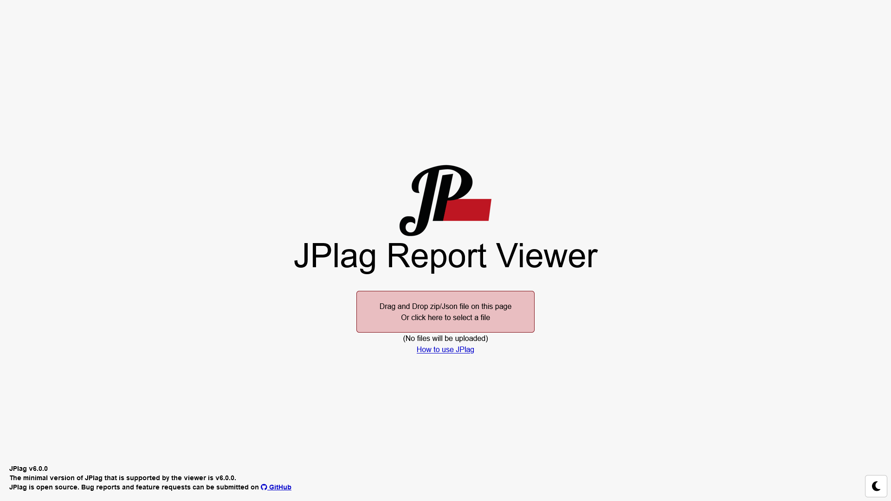
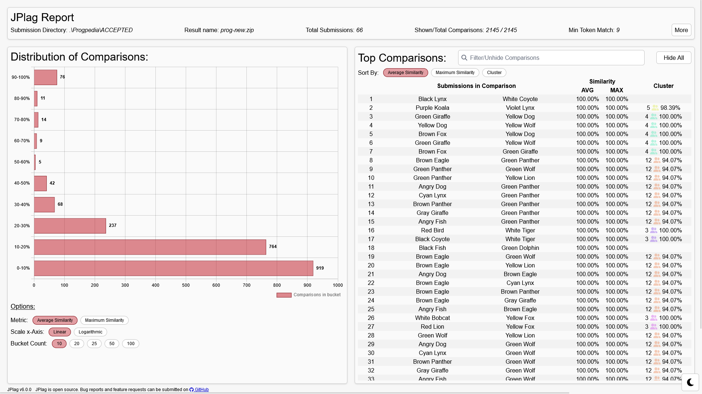
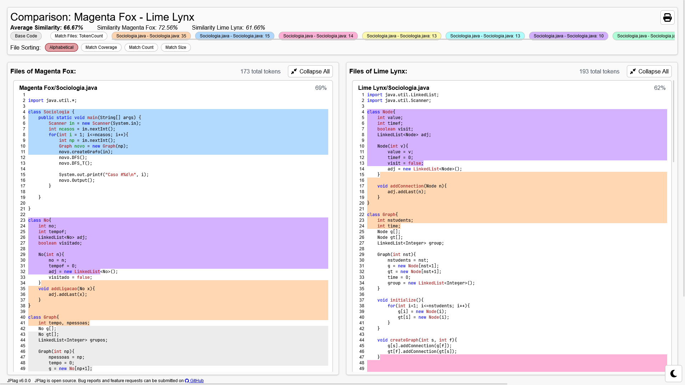
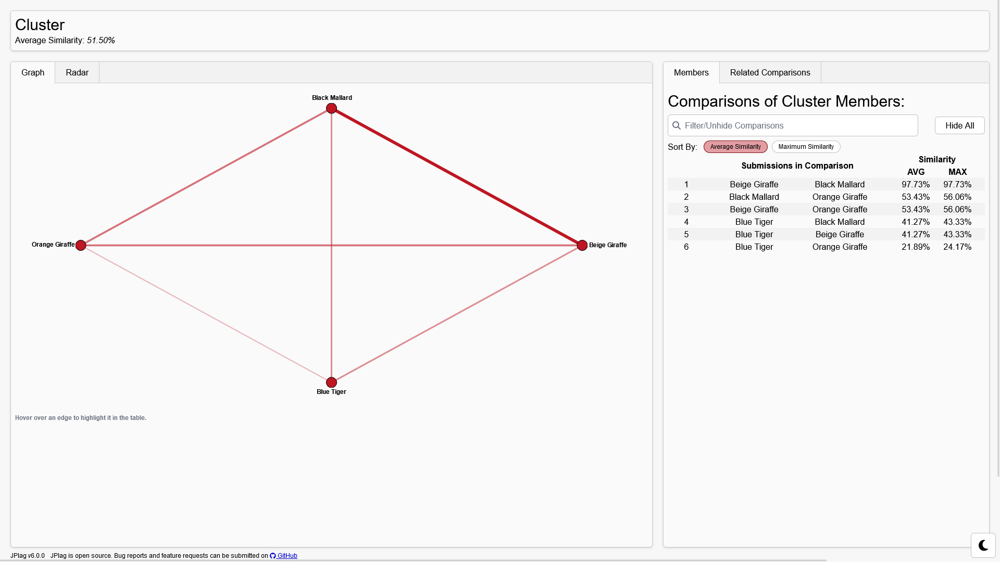
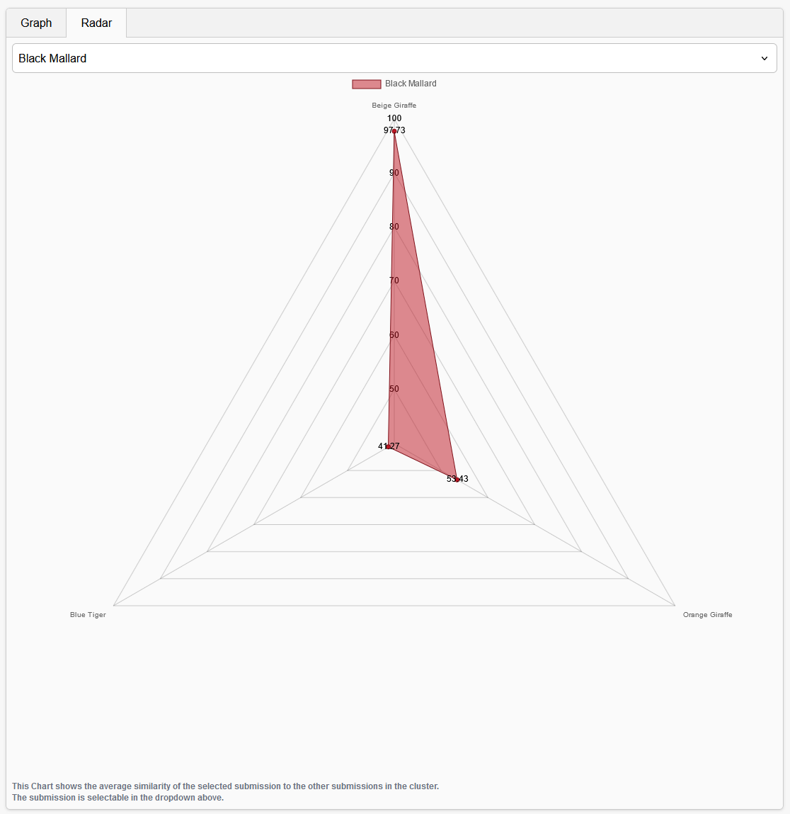
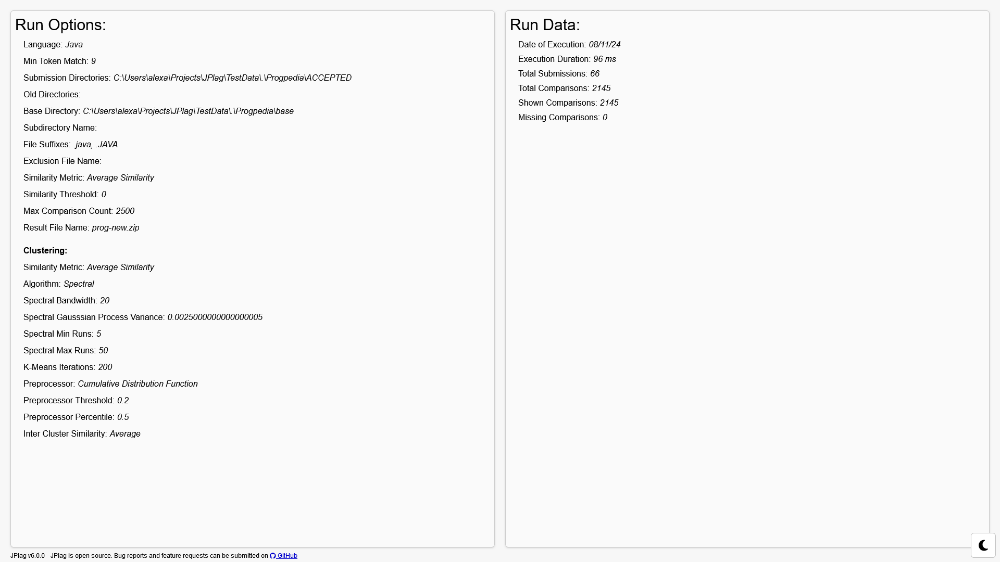
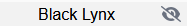

The JPlag Report Viewer is a web application that can be used to display the result file generated by JPlag. 

## Opening Reports
The report viewer can be started via the JPlag JAR file by specifying the mode. This is done over the `--mode`/`-M` flag (available since version 6.0.0):
|Value|Effect|
|---|---|
| run_and_view | Runs JPlag on the given files with the given options. After running, it opens the report viewer. The report viewer will then automatically load the result. |
| view | Opens the report viewer. When providing a result file from a previous JPlag run - either in a way a source directory would be given or through the `-r` flag. If no file is given, the landing page will be opened. |
| run | Runs JPlag without opening the report viewer. |

When no value is given for the mode flag, JPlag tries to guess the best mode. When calling it with submission files, it executes the `run_and_view` mode. When the positional argument is a result file including a report, it starts the `view` mode and opens the given report. When no arguments are given, the report viewer is started in `view` mode without any given file, leading to the [landing page](#file-upload--landing-page-).

### Landing Page
On the landing page, a report can be opened by either dragging the result file onto the page. Alternatively, when clicking the red square, a file chooser dialog will open.

Reports can be fetched from a server by appending `?file=URL`. 
Example: `jplag.github.io/JPlag?file=domain.tld/my-report.jplag` 

### Reports from older versions
With increasing versions, the report may change, and the report viewer may not be able to read a report from an earlier version. 
When trying to open such a report, the report viewer will redirect you to an older version of the report viewer.
This older report viewer may not support all the newest features of JPlag.
This feature is only available when starting the report viewer through the jar.

## Running Locally from Sources

### Setup
The application requires Node.js and npm to be installed on the system.
```
npm install
```

### Run the development server
```
npm run dev
```

### Compile and build
There are different ways to build the report-viewer.

The report viewer will be built and packaged with the CLI in a jar file if built with the `with-report-viewer` profile:
```
mvn -Pwith-report-viewer clean package assembly:single
```

To build it in the standard way, without any base URL, run:
```
npm run build
```

For production builds (for example, to host on GitHub Pages in a repository called `JPlag`), run:
```
npm run build-prod
```
When hosting this build, it will need to be accessible under `yourdomain.tld/JPlag/`.


To build the demo version, run:
```
npm run build-demo
```
Similar to the production build, this build will have `demo` as its base URL.

## Features

### File Upload / Landing Page (`/`)

This view is used to load files into the report viewer. More information can be found [above](#landing-page).

### Overview (`/overview`)

The Overview shows general information about the entire dataset and is not specific to a single comparison.

The top shows some general information about the report. More [information](#information-information) can be accessed over the more button.

The distribution diagram splits the submissions into buckets according to a certain similarity metric. This includes all calculated comparisons, not just the ones included in the report.
The used metric can be changed in the options under the diagram. In addition, the number of buckets can be changed. The scale can be switched between a linear and a logarithmic representation.

The comparison table displays the included comparisons. These may not be all comparisons performed by JPlag, depending on the number of submissions and the configured options. The table can be sorted by each metric or grouped by cluster. 
The search bar has multiple features:
- It filters the rows of the table by the names of the submissions. To filter for multiple names, separate them by a space. The parts come together in a disjunctive way.
- It filters the table by index, either by just typing a number (e.g. `81`) or prefacing it with the `index` keyword (e.g. `index:81`)
- It filters by metric when the number is prefaced with a comparator (</>/<=/>=) (e.g. >90). To filter by a specific metric, preface the comparator with its short metric name (e.g. avg:>90)
- When fully typing out a name, it gets unhidden

Each row shows the index, the names of the two submissions in the comparison, and their similarities in the different metrics. Comparisons that are part of a cluster will have that information displayed at the end of a row. All comparisons in a cluster have their icon colored the same. The number behind the icon shows how many submissions are included in the cluster. Clicking this icon will open the [cluster in its own view](#cluster-cluster).
When hovering over a name, an eye will show up. Clicking this eye toggles the anonymization of this submission.
Clicking the other parts of the [opens the comparison](#comparison-comparison).

### Comparison (`/comparison`)

At the top of the comparison view, different similarities for the submission can be seen. The average similarity is the same as that shown in the comparison table. The similarities labeled with the submission names show the percentage of tokens for the named submission that appear in the other one.

Below that, the bubbles represent a single match. They show the file names in both submissions and the number of tokens in the match. Clicking on this bubble will scroll to both matches in the code.

The files can also be sorted by the following options:
| Alphabetic | Sorts the files by their name. |
| Match Coverage | Sorts the files by how many of its tokens are part of a match in descending order. |
| Match Count | Sorts the files by the number of matches in them in descending order. |
| Match size | Sorts the files by their largest match in descending order. |

Each code container has a list of files. The file order can be changed either through the options described above or by dragging them around.
The percentage at the end of each file header shows how many tokens of the file are part of a match.
Clicking on this header expands and collapses the file content.

The matches are visualized via colored blocks. Clicking on one scrolls to the match in the other submission's code.

### Cluster (`/cluster`)


At the top of the page, some general information about the cluster, such as its similarity, is given.

On the left, there are two ways to display a cluster
In the graph, each node represents a submission. The thickness and opacity of the edge are indicators for the similarity of the comparison between the two submissions. When a comparison is not part of the report, its edge will be gray and dotted. Hovering over an edge will highlight it in the table on the right.


The other option to display a cluster is a radar chart. It may not be available in some reports when there are not enough comparisons of this cluster present.
It shows the similarity of the other submissions in a cluster relative to one submission. This submission can be changed in the dropdown at the top. Not all submissions may be available here because there are not enough comparisons in the report. 

The table on the right has two modes that can be changed at the top.
The mode called "Members" shows a similar comparison table to the [overview](#overview-overview) only containing the comparisons of this cluster.
The mode called "Related Comparisons" also holds a similar table. Each comparison in this table has one submission from the cluster, while the other is not part of the cluster. This can be used to identify false negatives in the clustering.

### Information (`/information`)

The information view displays data about the run, like date, execution time, and number of submission.

It also displays all the options used by JPlag.

## Annonymization
When anonymizing a submission, its name gets replaced by the word `anon` followed by a number. This number gets chosen when first anonymizing a submission and stays unique for this submission until closing the report. If the submission name is present in the code or the filename, it does not get replaced there.

There are two ways to anonymize a submission. When hovering over a submission in a table, an eye will become visible. Clicking it will change its anonymization status.



The other option is to click the "Anonymize All" button at the top of the comparison table. When all submissions are anonymized, it will change to a "Show All" button that will de-anonymize all submissions.


## Contributing

We're happy to incorporate all improvements to JPlag into this codebase. Feel free to fork the project and send pull requests. Please consider [our guidelines for contributions](https://github.com/jplag/JPlag/wiki/3.-Contributing-to-JPlag).

Before committing, please run the following commands to ensure that the code is properly formatted and linted.
```
npm run format
npm run lint
```
This can also be done automatically by the pre-commit hooks. They get automatically installed when running `npm install`.
