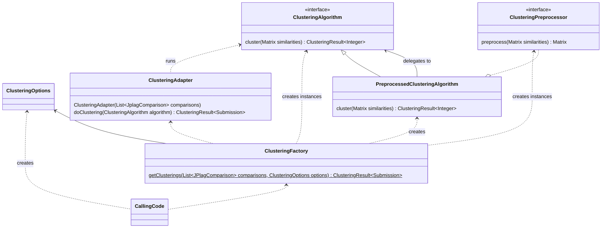

## Clustering Usage

By default, JPlag is configured to cluster the submissions.
The clustering partitions the set of submissions into groups of similar submissions.
The found clusters can be used as candidates for _potentially_ colluding groups. Each cluster has a strength score that measures how _suspicious_ the cluster is compared to other clusters.

### Disabling Clustering

Clustering can take a long time when there is a large number of submissions.
Users who are not interested in clustering can safely disable it with the `--cluster-skip` option.

### Clustering Configuration

Clustering can either be configured using the CLI options or programmatically using the `ClusteringOptions` class. Both options work analogously and share the same default values.

__The clustering is designed to work out-of-the-box for running within the magnitude of about 50-500 submissions__, but it can be tweaked when problems occur. For more submissions it might be necessary to increase  `Max-Runs` or `Bandwidth`, so that an appropriate number of clusters can be determined.

| Group | Option | Description | Default |
| --- | --- | ----------- | - |
| General | Enable | Controls whether the clustering is run at all. | `true` | 
| General | Algorithm | Which clustering algorithm to use. <dl><dt>Agglomerative Clustering</dt><dd>Agglomerative Clustering iteratively merges similar submissions bottom up. It usually requires manual tuning for its parameters to yield helpful clusters.</dd><dt>Spectral Clustering</dt><dd>Spectral Clustering is combined with Bayesian Optimization to execute the k-Means clustering algorithm multiple times, hopefully finding a \"good\" clustering automatically. Its default parameters should work O.K. in most cases.</dd></dl> | Agglomerative Clustering |
| General | Metric | The similarity score between submissions to use during clustering. Each score is expressed in terms of the size of the submissions `A` and `B` and the size of their matched intersection `A ∩ B`. <dl><dt>AVG (aka. Dice's coefficient)</dt><dd>`AVG = 2 * (A ∩ B) / (A + B)`</dd><dt>MAX (aka. overlap coefficient)</dt><dd>`MAX = (A ∩ B) / min(A, B)` Compared to MAX, this prevents obfuscation when a collaborator bloats his submission with unrelated code.</dd><dt>MIN (_deprecated_)</dt><dd>`MIN = (A ∩ B) / max(A, B)`</dd><dt>INTERSECTION (_experimental_)</dt><dd>`INTERSECTION = A ∩ B`</dd></dl> | AVG |
| Spectral | Bandwidth | For Spectral Clustering, Bayesian Optimization determines a fitting number of clusters. If a good clustering result is found during the search, numbers of clusters that differ by something in range of the bandwidth are also expected to good. Low values result in more search space exploration, and high values result in more exploitation of known results.  | 20.0 |
| Spectral | Noise | The result of each k-Means run in the search for good clusterings is random. The noise level models the variance in the \"worth\" of these results. It also acts as a regularization constant. | 0.0025 |
| Spectral | Min-Runs | Minimum number of k-Means executions for spectral clustering. With these initial runs, clustering sizes are explored. | 5 |
| Spectral | Max-Runs | Maximum number of k-Means executions during spectral clustering. Any execution after the initial (min-) runs tries to balance between exploring unknown clustering sizes and exploiting clustering sizes known as good. | 50 |
| Spectral | K-Means Iterations | Maximum number of iterations during each execution of the k-Means algorithm. | 200 |
| Agglomerative | Threshold | Only clusters with an inter-cluster similarity greater than this threshold are merged during agglomerative clustering. | 0.2 |
| Agglomerative | inter-cluster-similarity | How to measure the similarity of two clusters during agglomerative clustering. <dl><dt>MIN (aka. complete-linkage)</dt><dd>Clusters are merged if all their submissions are similar.</dd><dt>MAX (aka. single-linkage)</dt><dd>Clusters are merged if there is a similar submission in both.</dd><dt>AVERAGE (aka. average-linkage)</dt><dd>Clusters are merged if their submissions are similar on average.</dd></dl> | AVERAGE |
| Preprocessing | Pre-Processor | How the similarities are preprocessed before clustering. Spectral Clustering will probably not have good results without it. <dl><dt>None</dt><dd>No preprocessing.</dd><dt>Cumulative Distribution Function (CDF)</dt><dd>Before clustering, the value of the cumulative distribution function of  all  similarities  is  estimated.  The  similarities  are multiplied by these estimates. This has the effect of suppressing low similarities compared to other similarities.</dd><dt>Percentile</dt><dd>Any similarity smaller than the given percentile will be suppressed during clustering.</dd><dt>Threshold</dt><dd>Any similarity smaller than the given threshold will be suppressed during clustering.</dd></dl> | CDF |

## Clustering Architecture

All clustering-related classes are contained within the core project's `de.jplag.clustering(.*)` packages.

The central idea behind the structure of clustering is the ease of use: To use the clustering calling code, one should only ever interact with the `ClusteringOptions`, `ClusteringFactory`, and `ClusteringResult` classes:

New clustering algorithms and preprocessors can be implemented using the `GenericClusteringAlgorithm` and `ClusteringPreprocessor` interfaces, which operate on similarity matrices only. `ClusteringAdapter` handles the conversion between `de.jplag` classes and matrices. `PreprocessedClusteringAlgorithm` adds a preprocessor onto another `ClusteringAlgorithm`.
### Remarks on Spectral Clustering

* based on [On Spectral Clustering: Analysis and an algorithm (Ng, Jordan & Weiss, 2001)](https://proceedings.neurips.cc/paper/2001/file/801272ee79cfde7fa5960571fee36b9b-Paper.pdf)
* automatic hyper-parameter search using Bayesian Optimization with a Gaussian Process as the surrogate model and L-BFGS for optimization on the surrogate
* the L-BFGS implementation is a pit of technical debt, [see here](https://github.com/jplag/JPlag/pull/281#discussion_r810171986).

### Integration Tests

There are integration tests for the Spectral Clustering to verify that, at least in the case of two known sets of similarities, the groups known to be colluders are found. However, these are considered to be sensitive data. The datasets are not available to the public and these tests can only be run by maintainers with access.

To run these tests, the contents of the [PseudonymizedReports](https://github.com/jplag/PseudonymizedReports) repository must be added in the folder `jplag/src/test/resources/de/jplag/PseudonymizedReports`.

